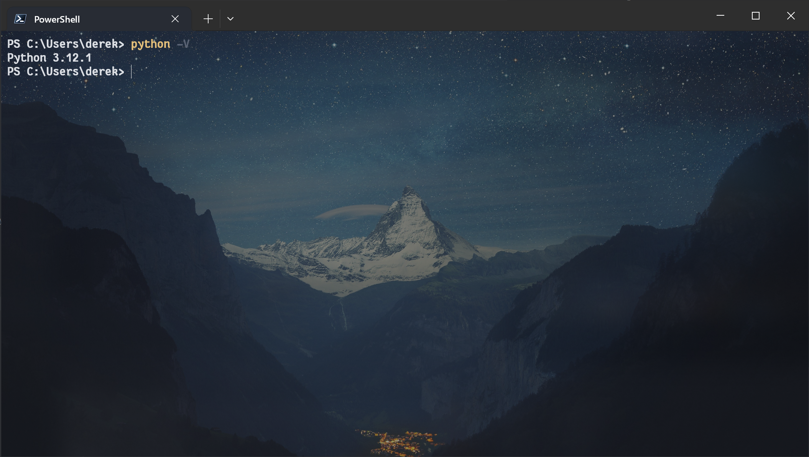
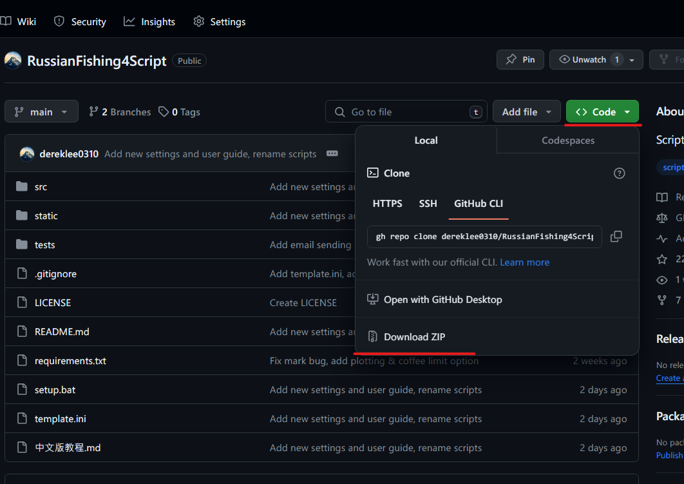
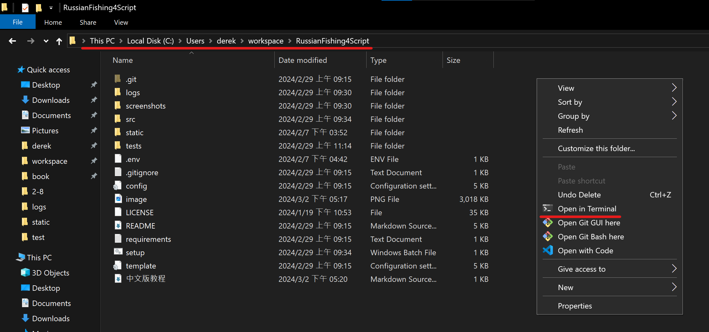
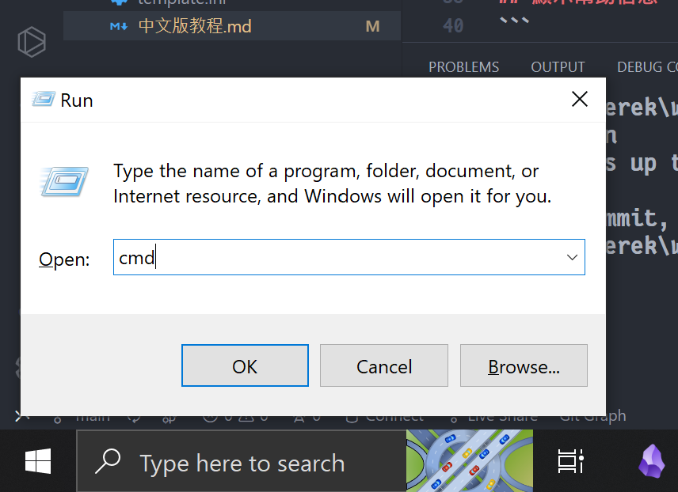

# 0. 下載並安裝Python
可以參考此[視頻](https://www.bilibili.com/video/BV1h3411G7Br/?spm_id_from=333.337.search-card.all.click)，後半部IDLE的使用可以暫時忽略。  
安裝完畢後，開啟命令行輸入`python -V`，
如果Python版本有正確顯示如下的話即代表安裝成功。


# 1. 下載儲存庫
如果已安裝Git:
```
git clone https://github.com/dereklee0310/RussianFishing4Script
```
也可以透過網站直接下載壓縮檔並解壓縮。


## 2. 前置工作
1. 複製項目絕對路徑

2. 按下Win+R並輸入`cmd`開啟終端。

3. 輸入以下指令以執行初始化設定並變更當前工作目錄至腳本路徑
```
cd 剛剛複製的路徑
setup.bat
cd src
``` 
## 3. 執行腳本
### 執行主程序
```
python app.py
```
接著輸入欲使用模式的id即可。
### 顯示幫助信息
```
python app.py -h
```
### 命令行參數
- `-a`: 保留所有捕獲的魚，為預設模式
- `-m`: 只保留達標魚
- `-c`: 跟魚纏鬥時自動喝咖啡補充體力
- `-r`: 在拋竿前自動消耗胡蘿蔔/茶補充飽食及體溫
- `-H`: 拋竿前自動挖餌，僅適用於水底模式
- `-e`: 執行完畢後寄信通知用戶，需配置Gmail帳戶相關信息
- `-P`: 繪製魚獲/時間關係圖並保存於logs/資料夾
- `-A`: 在入護前定時喝酒
- `-n 數量`: 指定當前漁戶內的魚數量以便在滿戶時自動退出，預設為0
- `-p 模式id`: 指定欲使用的模式id

## 4. 其他腳本
### 開啟/關閉前進模式
- 執行後自動按住W鍵控制腳色前進，按w暫停，按s退出
```
python move.py
```

### 製作物品
- 選擇欲製作的物品及材料後即可執行，預設為材料用完後停止
- 可搭配`-n 數量`參數指定欲製作的物品數量
- 使用`-d`即可丟棄所有製作的物品，用於沖技能
```
python craft.py
```

### 計算掛機時可用的最大摩擦
- 根據提示輸入釣組參數即可
```
python calculate.py
```

### 原地掛機自動挖餌+自動補充體力
- 懶得找點位就站著挖餌唄
```
python harvest.py
```

## 5. 腳本設定與文件配置
可參考`README`和`template.ini`中的說明以及[視頻](https://www.youtube.com/watch?v=znLBYoXHxkw)。
## 6. 備註
本中文教程仍在製作中，其他細節請看[英文版教程](README.md)。


## 7. 聯繫方式
- WeChat  

- Email: dereklee0310@gmail.com


