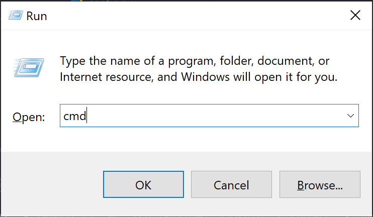

## 項目介紹
俄羅斯釣魚4掛機腳本
- [Discord](https://discord.gg/BZQWQnAMbY)
- [視頻教程](https://www.youtube.com/watch?v=znLBYoXHxkw)

## 4/19 更新補丁
**請參考`template.ini`以使用新添加的功能**
- 終止簡體及繁體支援，詳見[Integrity Guide](./integrity_guide.md)
- 添加檔案完整性驗證
- 改善部分簡體中文圖片品質
- 添加預設命令列參數的設定
- 添加未達標魚釋放白名單的設定
- 添加自動更換壞掉擬餌的功能
- 修正釣竿狀態被錯誤識別的問題
- 修正清杯時不會退出遊戲的問題
- 修正繪圖功能的錯誤 

##  前置工作
### 1. 下載並安裝Python
可以參考此[視頻](https://www.bilibili.com/video/BV1h3411G7Br/?spm_id_from=333.337.search-card.all.click)，後半部IDLE的使用可以暫時忽略。  
安裝完畢後，開啟命令行輸入`python -V`，
如果Python版本有正確顯示如下的話即代表安裝成功。


### 2. 下載儲存庫
- 選項一: [下載](https://github.com/dereklee0310/RussianFishing4Script/archive/refs/heads/main.zip)壓縮檔並解壓縮。
- 選項二: 使用`git clone <url>`命令，需安裝Git。
```
git clone https://github.com/dereklee0310/RussianFishing4Script
```

### 3. 初始化設定並變更當前工作目錄至腳本路徑
1. 複製項目絕對路徑

2. 按下Win+R並輸入`cmd`開啟終端。

3. 在終端中輸入以下命令
```
cd 剛剛複製的路徑
setup.bat
cd src
``` 
## 執行腳本
### 執行主程序
```
cd 項目路徑
cd src
python app.py
```
接著輸入欲使用模式的id即可。
### 顯示幫助信息 (非常有用)
```
python app.py -h
```
### 常用命令行參數
- `-m`: 只保留達標魚
- `-c`: 跟魚纏鬥時自動喝咖啡補充體力
- `-A`: 定時喝酒
- `-r`: 在拋竿前自動消耗胡蘿蔔/茶補充飽食及體溫
- `-H`: 拋竿前自動挖餌，僅適用於水底模式
- `-e`: 執行完畢後寄信通知用戶，需配置郵箱相關設定
- `-P`: 繪製魚獲/時間關係圖並保存於logs/資料夾
- `-s`: 執行完畢後自動關機
- `-l`: 中魚後收線時頻繁抬桿
- `-g`: 自動切換傳送比
- `-R`: 使用彩虹線米數偵測是否收線完畢
- `-n 數量`: 指定當前漁戶內的魚數量以便在滿戶時自動退出，預設為0
- `-p 模式id`: 指定欲使用的模式id
### 範例
- 自動喝茶和咖啡、吃胡蘿蔔、釋放未達標魚，使用策略1
```
python app.py -r -c -m -p 1
```

## 其他腳本
### 開啟/關閉前進模式
- 執行後自動按住W鍵控制腳色前進，按w暫停，按s退出
```
python move.py
```

### 製作物品
- 選擇欲製作的物品及材料後即可執行，預設為材料用完後停止
- 可搭配`-n 數量`參數指定欲製作的物品數量
- 使用`-d`即可丟棄所有製作的物品，用於沖技能
```
python craft.py
```

### 計算釣組可用的最大摩擦
- 根據提示輸入釣組參數即可
```
python calculate.py
```

### 原地掛機自動挖餌+自動補充體力
- 使用`-s`以在等待間隔切換至設定介面，節省不必要的畫面渲染
- `-n 秒數`可以自定義等待間隔的時間
```
python harvest.py
```

## 腳本設定與文件配置
參考`README`和`template.ini`中的說明, 並在`config.ini`及`.env`中修改設定。

## 備註
本中文教程仍在製作中，其他細節請看[英文版教程](README.md)。  
如果你覺得這個腳本有幫助到你的話，請給這個repo一個星星 :)

## 聯繫方式
- WeChat  

- Email: dereklee0310@gmail.com